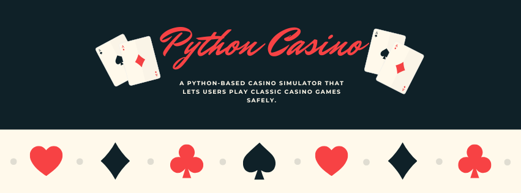

# Python Casino Simulator 🎰

A professional Python-based casino simulator featuring **Slot Machines, Blackjack, and Roulette**.  
This project provides a safe, non-real-money environment for playing classic casino games, focusing on **accurate game logic, randomness, and clean, maintainable code**.  
Ideal for learning Python, understanding game mechanics, and experimenting with a structured casino simulation.

---

## 🚀 Technologies Used

- **Python 3** – Core programming language for game logic  
- **Random Module** – For generating game randomness  
- **Object-Oriented Programming** – Structured code for games  
- **Terminal / CLI Interface** – Simple and clean user interaction  

---

## 📌 Main Features

- Play **Slot Machines** with virtual coins  
- Play **Blackjack** against a computer dealer  
- Play **Roulette** with multiple betting options  
- Safe, educational environment – no real money involved  
- Clean and structured Python codebase for learning and modification  

---

## 🧠 How the Project Works

1. The user selects a game: **Slots**, **Blackjack**, or **Roulette**  
2. Each game runs in the terminal using Python CLI  
3. The game handles bets, turns, and outcomes using Python logic  
4. Randomness ensures a fair simulation for Slots and Roulette  
5. The user can play multiple rounds, tracking virtual coins  

---

## ⚠️ Disclaimer

- This project **does not involve real money**  
- All coins and bets are virtual  
- Intended for **educational purposes only**  

---

## 📚 Project Purpose

This project was developed to:

- Practice **Python programming** and **OOP principles**  
- Simulate classic casino games in a safe environment  
- Learn **game mechanics, randomness, and structured coding**  
- Provide a portfolio-ready project showcasing **Python skills**  

---

## 👨‍💻 Author

**Jaume Vanacloig**  
Web Application Development (DAW) Student  
Portfolio: [https://github.com/JaumeCode](https://github.com/JaumeCode)

